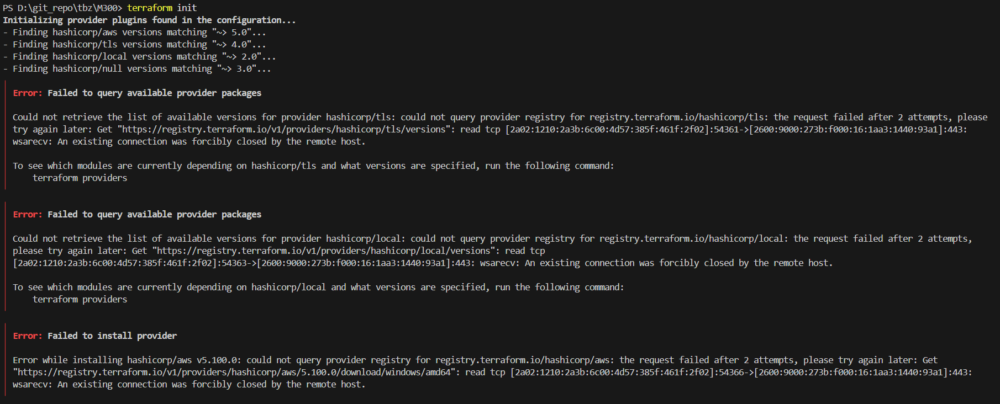
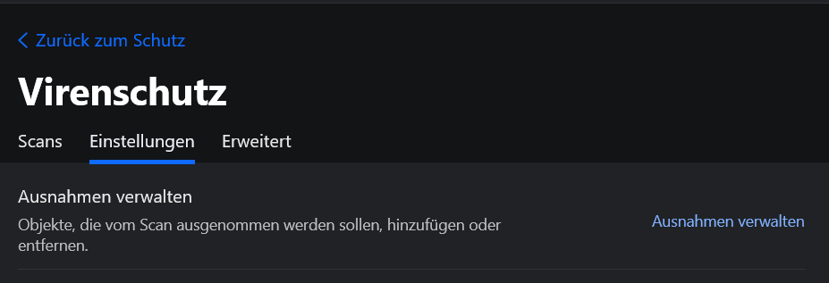
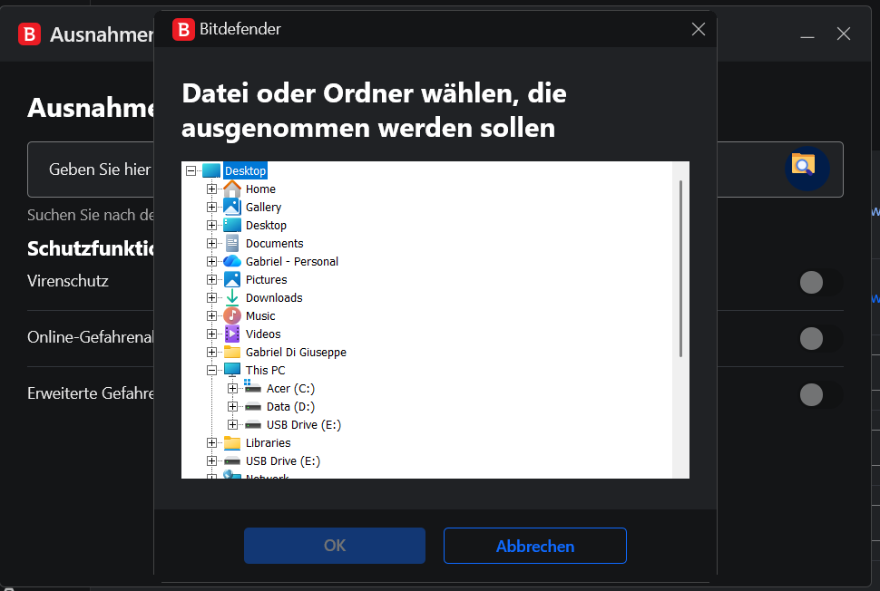
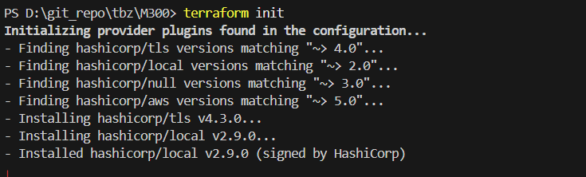
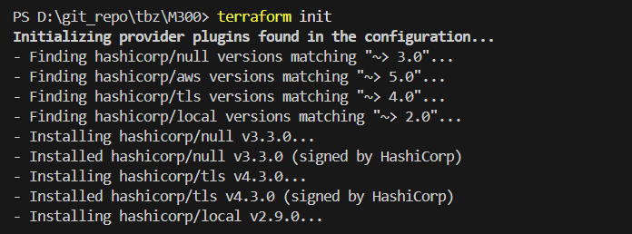
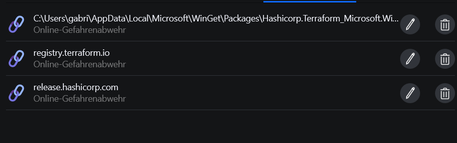

# Tag 5
Heute habe ich versucht das ganze Setup, das ich auf meinem Laptop habe, auf meinem Persönlichen COmputer rüberzu kopieren, damit ich effizienter arbeiten kann. Da er Leistungsfähiger ist, und 2 Bildschribe hat.

Die Installation der einzelnen Services war kein Problem, jedoch gibt es einen recht grossen Unterschied zwischen meinem Laptop und PC, denn ich zuvor nicht wirklich war gennommen habe. Mein PC hat den Bitdefender installiert. Mir war das bewusst, ich dachte jedoch nicht das es mich irgendwie beinflussen wird.

Ich war zu begin nicht sicher wieso das der Install fehlschlägt. Internet hatte ich, da ich sonst das Git Repository garnicht Klonen könnte.
Ich habe zuerst meine Windows Firewalls kontrolliert, jedoch nichts wirklich entdeckt. 

Schlussendlich bin ich auf Forums gegangen, und gesehen, das Antiviren die Packete von Terraform duchgehen, was die gegen die TSL-Regelung verstösst, was den Fehler verursacht.

Schlussendlich musste ich im Bitfedenter-Tool eine Exception machen

Nach dem Ersten versuch hat es schon besser ausgesehen. Jedoch noch nicht Perfekt

