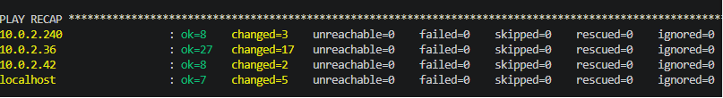
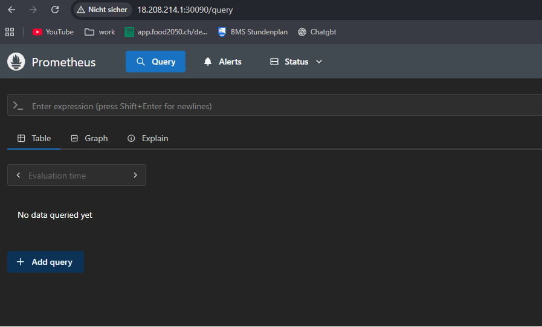
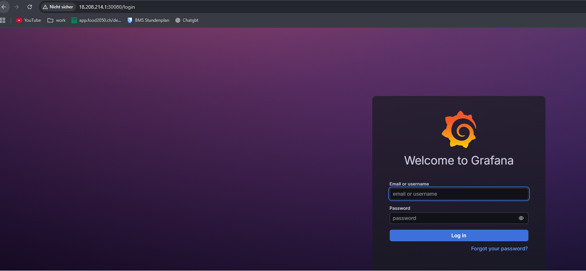
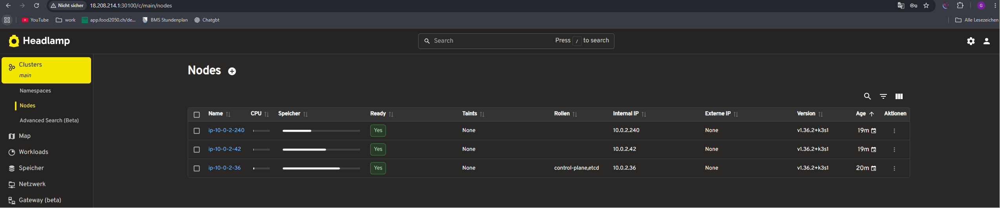
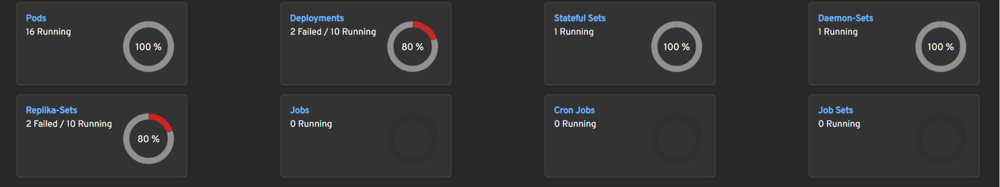

# Tag 6
Heute habe ich mit der Integration der WEbap begonnen, dafür habe ich eine kleine generische 3 Schichten Webap erstellt, die aus einem Frontend, einem Backend und einer Datenbank besteht. Die Datenbank ist eine Postgres DB, die über ein Secret und ein PVC bereitgestellt wird.
Dazu noch habe ich die funktionalität des Monitorings sichergestellt.

Und zum ersten mal ist mein ganzes Ansible Playbook ohne Fehler durchgelaufen, was mich sehr freut, da ich jetzt die Möglichkeit habe, alles von Anfang an zu testen und zu deployen.

Hier sind Screenshots der laufenden Seiten:

