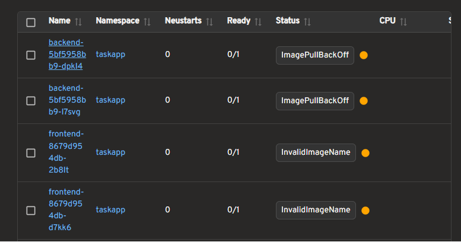
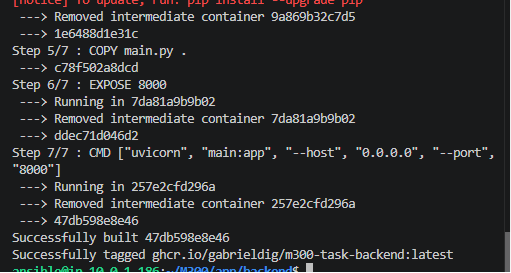
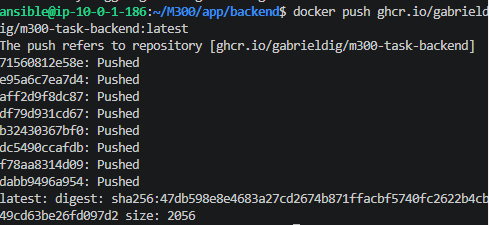
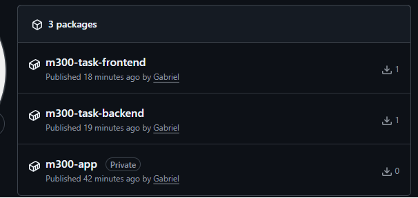
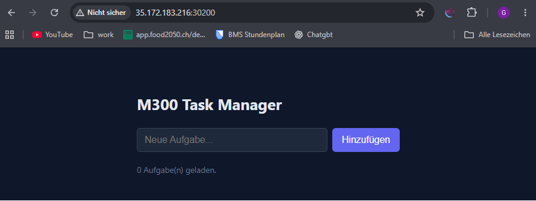
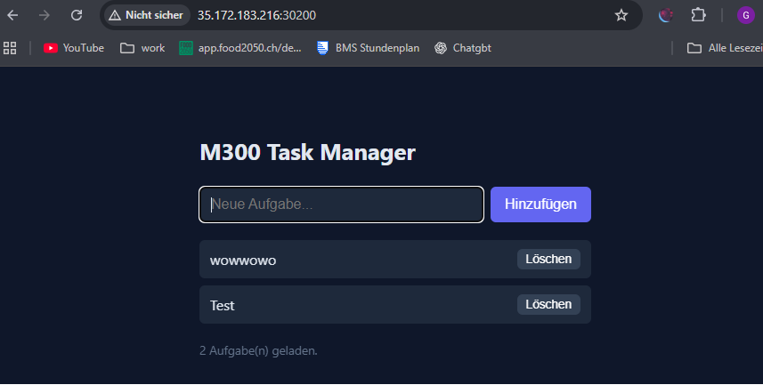

# Tag 8

Heute habe ich die finalen Schritte gemacht.
Da bisher die Docker images noch nicht auf Github oder Docker hochgeladen waren hat das starten immer fehlgeschlagen

DA ich Docker nicht lokal hatte, ,musste ich zuerst das Terraform starten um die Umgebung zu starten.

In Github musste ich ein developer token erstellen, damit ich die Images hochladen konnte. Danach habe ich die Images hochgeladen und konnte dann das Playbook starten.

(Kann ich aus Sicherheitsgründen nicht zeigen) 

Dannach musste ich auf dem Ansible host docker installieren. 

Dann habe ich die Images lokal erstellt, und schliesslich nach Github gepusht

Und das musste ich fürs Frontend und BAckend machen. Danach konnte ich das Playbook starten und es hat funktioniert.

Zu beginn hat es nnicht Funktionniert, ic hwar auc hsehr verwirrt, da ich dachte das ich alels richtig gemacht habe.

SChlussendlich habe ich herausgefunden, dass man die Images selbst in Github noch Public machen muss, da sie standartmässig Privat sind.

UND ZU GUTER LETZT HAT ES FUNKTIONIERT!!!!

Auch wenn es eine Sehr basische Seite ist, ist alles was dahinter steckt, sehr komplex und ich habe viel gelernt. Ich bin froh, dass ich es geschafft habe, und das ich jetzt eine funktionierende Umgebung habe.

> Vorheriger Tag -> [Tag 7](./Tag7.md)
