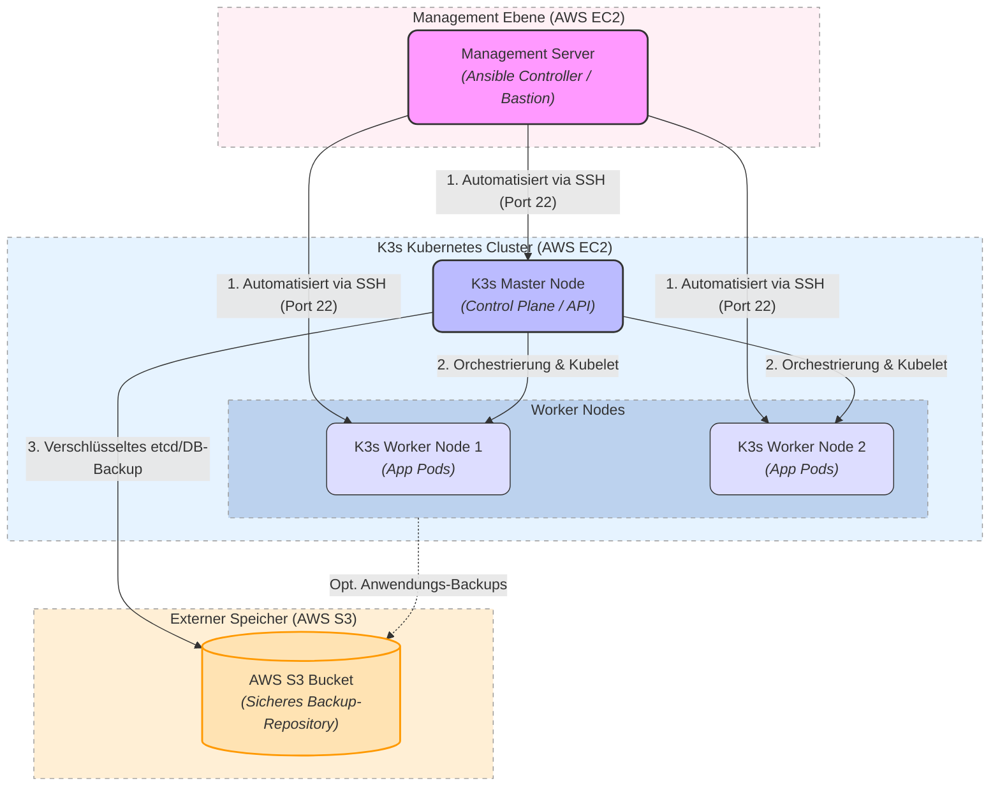

```mermaid
graph TB
    %% Definition der Subgraphs (Logische Gruppierung)
    subgraph Management ["Management Ebene (AWS EC2)"]
        MgmtServer["Management Server<br><i>(Ansible Controller / Bastion)</i>"]
    end

    subgraph K3sCluster ["K3s Kubernetes Cluster (AWS EC2)"]
        MasterNode["K3s Master Node<br><i>(Control Plane / API)</i>"]
        
        subgraph Workers ["Worker Nodes"]
            Worker1["K3s Worker Node 1<br><i>(App Pods)</i>"]
            Worker2["K3s Worker Node 2<br><i>(App Pods)</i>"]
        end
    end

    subgraph Storage ["Externer Speicher (AWS S3)"]
        S3Bucket[("AWS S3 Bucket<br><i>(Sicheres Backup-Repository)</i>")]
    end

    %% Definition der Verbindungen und Datenflüsse
    %% Ansible Steuerung (SSH)
    MgmtServer -- "1. Automatisiert via SSH (Port 22)" --> MasterNode
    MgmtServer -- "1. Automatisiert via SSH (Port 22)" --> Worker1
    MgmtServer -- "1. Automatisiert via SSH (Port 22)" --> Worker2

    %% Cluster interne Kommunikation
    MasterNode -- "2. Orchestrierung & Kubelet" --> Worker1
    MasterNode -- "2. Orchestrierung & Kubelet" --> Worker2

    %% Backup Datenfluss
    MasterNode -- "3. Verschlüsseltes etcd/DB-Backup" --> S3Bucket
    Workers -.->|Opt. Anwendungs-Backups| S3Bucket

%% Styling / Verschönerung des Diagramms und der Kästen
    style MgmtServer fill:#f9f,stroke:#333,stroke-width:2px,rx:10,ry:10
    style MasterNode fill:#bbf,stroke:#333,stroke-width:2px,rx:10,ry:10
    style Worker1 fill:#ddf,stroke:#333,stroke-width:1px,rx:10,ry:10
    style Worker2 fill:#ddf,stroke:#333,stroke-width:1px,rx:10,ry:10
    style S3Bucket fill:#ffe3b3,stroke:#ff9900,stroke-width:2px
    
    %% DEFINIERTE VERFÄRBUNGEN DER GROSSEN KÄSTEN
    classDef managementStyle fill:#fff0f5,stroke:#999,stroke-width:1px,stroke-dasharray: 5 5,color:#333;
    classDef k3sClusterStyle fill:#e6f3ff,stroke:#999,stroke-width:1px,stroke-dasharray: 5 5,color:#333;
    classDef workerNodesStyle fill:#bcd2ee,stroke:#999,stroke-width:1px,stroke-dasharray: 5 5,color:#333;
    classDef storageStyle fill:#ffefd5,stroke:#999,stroke-width:1px,stroke-dasharray: 5 5,color:#333;

    class Management managementStyle
    class K3sCluster k3sClusterStyle
    class Workers workerNodesStyle
    class Storage storageStyle
```