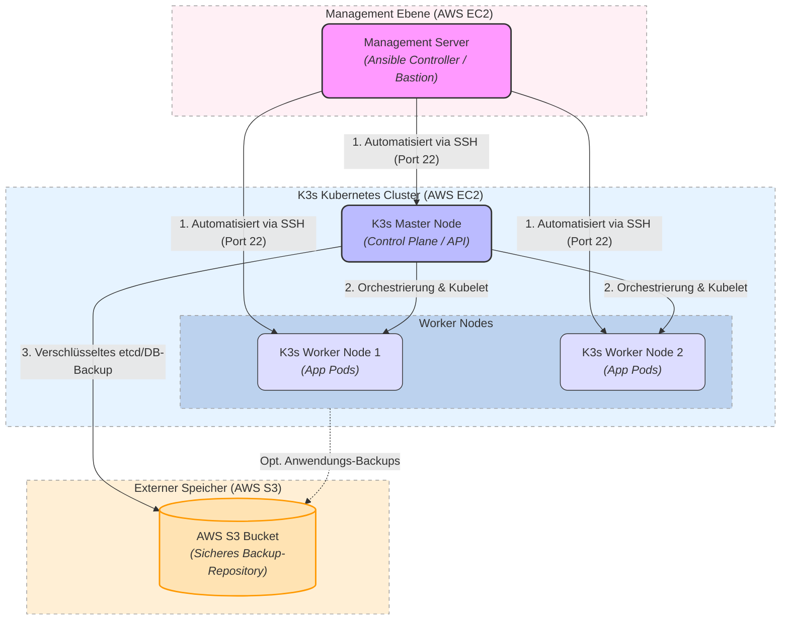

# Modul 300 – Plattformübergreifende Dienste in ein Netzwerk integrieren
 
 Anleitungsartikel -> [Bedienungsanleitung](./Tutorial.md)
Automatisierter Aufbau einer AWS-Cloud-Infrastruktur mit Terraform (Provisionierung)
und Ansible (Konfiguration): ein K3s-Kubernetes-Cluster hinter einem Bastion Host,
mit Monitoring-Stack und einer selbst entwickelten 3-Schicht-Applikation (Task Manager).
 
## Architektur-Übersicht
 
| Komponente | Technologie | Beschreibung / Rolle im Projekt |
| :--- | :--- | :--- |
| **Infrastruktur** | AWS (EC2, VPC, S3) | Cloud-Plattform für die Bereitstellung der virtuellen Server und des Netzwerks. |
| **Provisionierung** | Terraform | Infrastructure as Code (IaC). Definiert und baut VPC, Subnetze, Sicherheitsgruppen und EC2-Instanzen vollautomatisch. |
| **Konfiguration** | Ansible | Agentenlose Konfigurations-Automatisierung. Installiert K3s auf allen Nodes, deployt den Monitoring-Stack und die Applikation. |
| **Container-Orchestrierung** | K3s (Kubernetes) | Leichtgewichtige Kubernetes-Distribution für ressourcenschonende Umgebungen. |
| **Applikation** | Task Manager (FastAPI + Nginx/Vanilla JS + PostgreSQL) | Eigene 3-Schicht-Demo-App, läuft als Deployment auf dem K3s-Cluster. |
| **Monitoring** | kube-prometheus-stack, Headlamp (Helm) | Cluster- und Node-Metriken via Grafana/Prometheus, Kubernetes-Dashboard via Headlamp. |
| **Öffentlicher Zugriff** | Nginx Reverse Proxy (auf dem Bastion Host) | Leitet Grafana, Prometheus, Headlamp und die Task-App vom Bastion Host auf die privaten NodePorts im Cluster weiter. |
| **Datensicherung** | AWS S3 + EBS | Bucket und dedizierte Backup-Manager-Instanz sind provisioniert; die eigentliche Backup-Automatisierung ist **noch offen** (siehe unten). |
 
## Komponenten-Beschreibung
 
### 1. Management Node (Bastion Host)
* **Bastion Host:** einzige Instanz mit öffentlicher IP, Gateway zum restlichen (privaten) Netzwerk.
* **Ansible Controller:** von hier aus wird das Playbook ausgeführt.
* **Nginx Reverse Proxy:** läuft direkt auf dem Bastion Host und leitet die Ports `30080` (Grafana), `30090` (Prometheus), `30100` (Headlamp) und `30200` (Task Manager) auf den privaten K3s-Master weiter. Dadurch braucht nur der Bastion Host eine öffentliche IP – der Cluster selbst bleibt komplett isoliert.
### 2. K3s Cluster
* **1x K3s Master (Control Plane):** verwaltet den Cluster-Zustand, stellt die Kubernetes-API bereit.
* **2x K3s Worker:** hier laufen die Pods der Applikation.
### 3. Task Manager Applikation
Eigene 3-Schicht-App im Namespace `taskapp`, deployt via Kubernetes-Manifeste:
* **Frontend:** statisches Vanilla-JS/HTML, ausgeliefert über Nginx, exponiert via NodePort `30200`.
* **Backend:** FastAPI mit CRUD-Endpoints (`/api/tasks`) und Health-Check (`/api/health`).
* **Datenbank:** PostgreSQL mit persistentem Volume (PVC), überlebt Pod-Neustarts.
### 4. Monitoring
Via Helm auf dem K3s-Master installiert:
* **kube-prometheus-stack:** Grafana (NodePort `30080`) und Prometheus (NodePort `30090`) für Cluster- und Node-Metriken.
* **Headlamp:** Kubernetes-Dashboard (NodePort `30100`) mit eigenem ServiceAccount und Login-Token.
### 5. Backup-Infrastruktur (provisioniert, Automatisierung offen)
Terraform legt bereits Folgendes an:
* Eine dedizierte **Backup-Manager**-Instanz in einem eigenen privaten Subnetz.
* Ein persistentes **EBS-Volume**, das `terraform destroy` übersteht (`skip_destroy = true`).
* Ein **S3-Bucket** mit Versionierung für externe Backups.
**Offen:** Es gibt aktuell noch kein Ansible-Task/Cronjob, der tatsächlich Daten (z.B. K3s-State oder die Postgres-DB) auf den Backup-Manager bzw. nach S3 sichert. Die Infrastruktur dafür steht, die Automatisierung selbst ist ein möglicher nächster Schritt.
