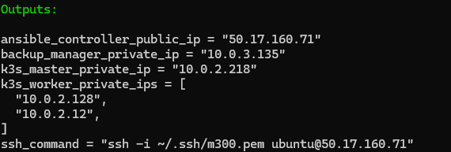
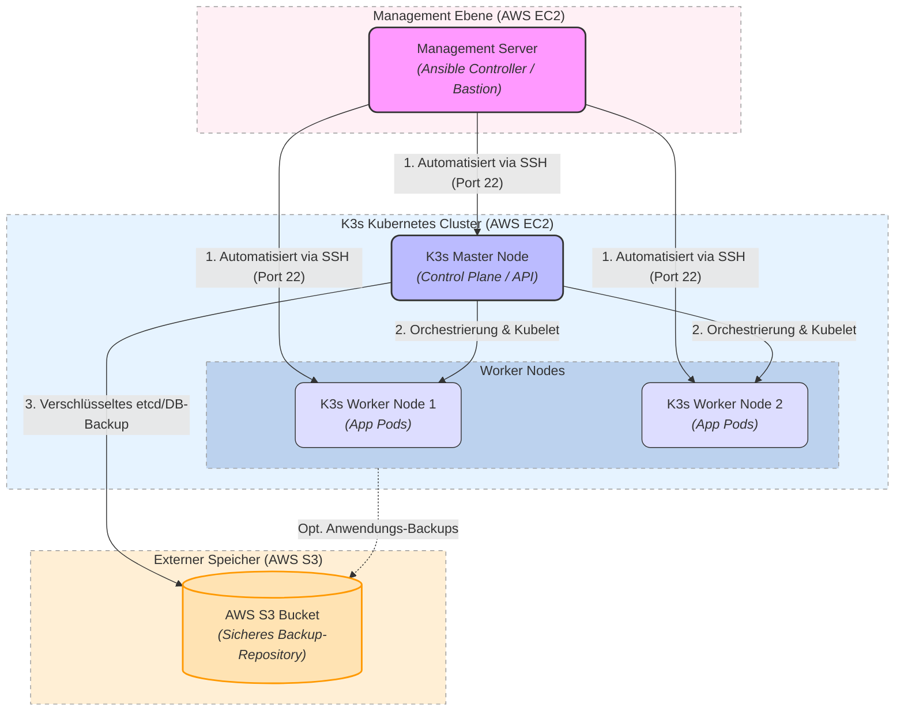

# Modul 300 Plattformübergreifende Dienste in ein Netzwerk integrieren

## Projektplan

## Architektur-Übersicht

| Komponente |Technologie |Beschreibung / Rolle im Projekt |
| :---        | :---        | :---                         |
| **Infrastruktur** | AWS (EC2, VPC, S3) | Cloud-Plattform für die Bereitstellung der virtuellen Server und des Netzwerks. |
| **Provisionierung** | Terraform | Infrastructure as Code (IaC). Definiert und baut das VPC, die Subnetze, Sicherheitsgruppen und EC2-Instanzen vollautomatisch. |
| **Konfiguration** | Ansible | Agentenlose Konfigurations-Automatisierung. Installiert und konfiguriert K3s, Docker und Absicherungen auf den Nodes. |
| **Container-Orchestrierung** | K3s (Kubernetes) | Eine hochgradig optimierte, leichtgewichtige Kubernetes-Distribution. Perfekt für ressourcenschonende Umgebungen. |
| **Lokaler Paket-Spiegel** | `debmirror` (Docker) | Ein "Run-and-Die"-Container, der eine ultra-schlanke, lokale Kopie von Ubuntu-Sicherheitsupdates vorhält (ohne GUIs/Spiele). |
| **Datensicherung** | AWS S3 | Externer, hochverfügbarer Objektspeicher für die automatisierten K3s- und Anwendungs-Backups. |

## Komponenten-Beschreibung

### 1. Management Node
Der Managementserver nimmt übernimmt die Managementrolle und dient als zentrale Steueranlage:
* **Bastion Host:** Er ist die einzige Instanz mit einer öffentlichen IP-Adresse und fungiert als sicheres Gateway zum K3s-Cluster, da sie in einem Isolierten Netzt liegen, ohne Öffentlichen Zugang.
* **Ansible Controller:** Von hier aus werden die Ansible-Playbooks gestartet.

### 2. K3s Cluster
* **1x K3s Master (Control Plane):** Verwaltet den Cluster-Zustand, steuert die Pods und stellt die Kubernetes-API bereit.
* **2x K3s Worker:** Hier laufen die eigentlichen containerisierten Anwendungen (Pods). Sie erhalten ihre Befehle und Netzwerk-Routing direkt vom Master.
  
#### 3. Backup-Strategie via AWS S3
Die Datensicherheit wird komplett von den Compute-Ressourcen entkoppelt:
* K3s triggert automatisierte Snapshots des Cluster-Zustands.
* Diese Backups werden verschlüsselt direkt in einen **AWS S3 Bucket** geladen.
* **Vorteil (Disaster Recovery):** Sollte das gesamte Cluster irreparabel beschädigt werden, kann die Infrastruktur mittels Terraform und Ansible innerhalb von Minuten neu aufgebaut und der Zustand aus dem S3-Bucket fehlerfrei wiederhergestellt werden.

## Kurzanleitung
Im Verzeichnis starten man das Projekt mit ``Terrafor plan`` und ``Terraform apply`` um die Infrastruktur aufzubauen.

Dannach sieht man ein output:

Im Output sieht man alles das man braucht, um sich mt dem Cluster zu verbinden:
- Öffentliche IP Addresse der Bastion Host
- Private IP Adressen der Master und Worker Nodes
- SSH Command um direkt auf die Master Node zuzugreifen.

Dannach muss man in den Ansible User wechseln mit ``sudo su ansible`` und von dort ins Homeverzeichnis gehen: ``cd ~``

Dort findet man das Github Repository und darin befindet sich der Ansible Ordner mit allen nötigen Scripts.

Mit ``ansible-playbook -i /home/ansible/M300/ansible/inventory.ini /home/ansible/M300/ansible/playbook.yml`` kann man das Playbook ausführen, um die K3s-Cluster zu konfigurieren.

