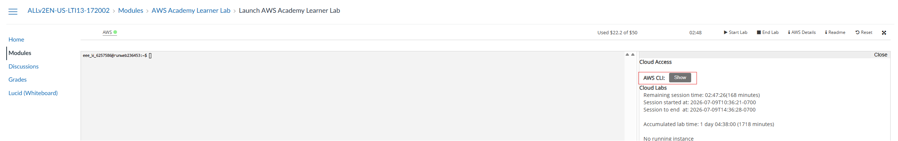
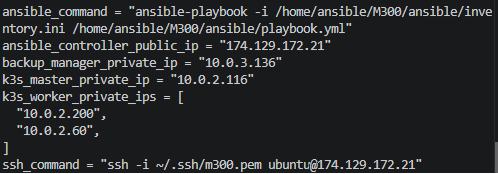
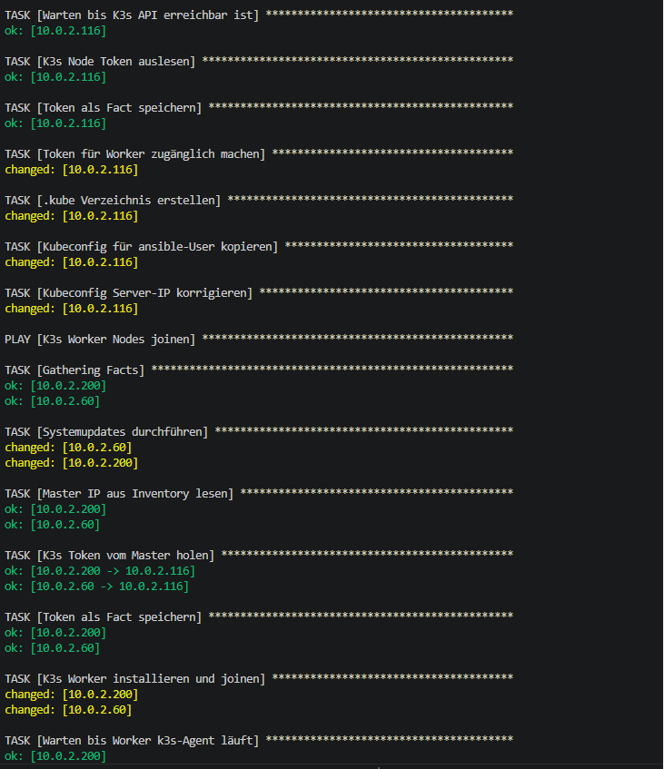
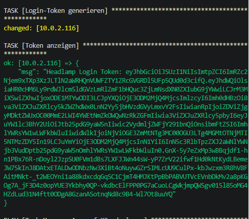
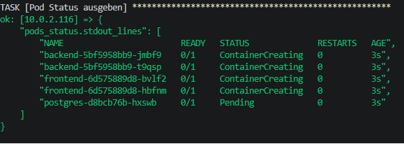
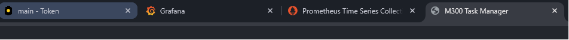
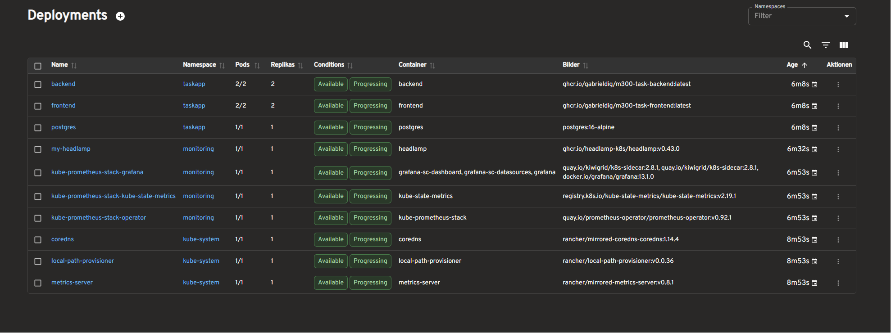

# Bedienungsanleitung für das M300 
(Man bräuchte eigentlich noch denn SSH-Schlüssel...)
Zuerst klont man das Repository lokal auf den Rechner.

> Terraform sowie AWS CLI müssen installiert und konfiguriert sein, um die Infrastruktur auf AWS zu erstellen.

Im AWS Lerner Academy startet man das Lerner Lab ein, und unter AWS Details kopiert denn AWSS Cloud Access key.

IM homeverzeichnis erstellt man ein .aws ordner, und darinn erstellt man ein file namens ``credentials`` und fügt dort den kopierten Access Key ein, so wie er ist.

Danach kann man im Terminal ins Repo gehen und ``terraform plan`` und ``terraform apply`` ausführen, um die Infrastruktur aufzubauen.

---

Sobald die Infrastrucktur aufgebaut ist, sollten die Outputs im Terminal angezeigt werden.

(Die Outputs werden immer anders seinn)
Es sind wichtige Informationen, wie die öffentliche IP Adresse der Bastion Host, die Private IP Adressen der Master und Worker Nodes, sowie ein SSH Command um direkt auf die Master Node zuzugreifen.

Zuerst führt man den SSH Command aus, um auf die Master Node zuzugreifen. Danach wechselt man in den Ansible User mit ``sudo su ansible``.

Danach kann man direkt den gezeigten Ansible Command ausführen, um das Playbook zu starten und die K3s Cluster zu konfigurieren. Dies dauert ein paar Minuten. Das gute dabei ist, man sieht gennau was in jedem Schritt gemacht wird, und kann so auch Fehler erkennen, falls welche auftreten.

Während des Ausführens des Playbooks wird die Logininformation für Headlamp angezeigt. Dies braucht man, um sich im Kubernetes-Dashboard anmelden zu können.

Schlussendlich sieht man auch noch welche Pods erstellt worden sind, und ob sie fehlerfrei gestartet  sind.

Dannach kopiert man die öffentliche IP Adresse des Ansible-Host und öffnet die unterschiedlichen Services im Browser, um zu sehen, ob sie korrekt laufen. 
- Grafana: http:// ``Ansible-Host-IP`` :30080
- Prometheus: http:// ``Ansible-Host-IP`` :30090
- Headlamp: http:// ``Ansible-Host-IP`` :30100
- Task Manager: http:// ``Ansible-Host-IP`` :30200

Dann sollten schon alle Seiten erreichbar sein, und man kann sich in Headlamp mit dem zuvor kopierten Token anmelden, um das Kubernetes-Dashboard zu sehen.

Auf dem Main Dashboard von Headlamp sieht man die laufenden Pods, und kann sich die Ressourcenverbrauch der einzelnen Pods anschauen.
